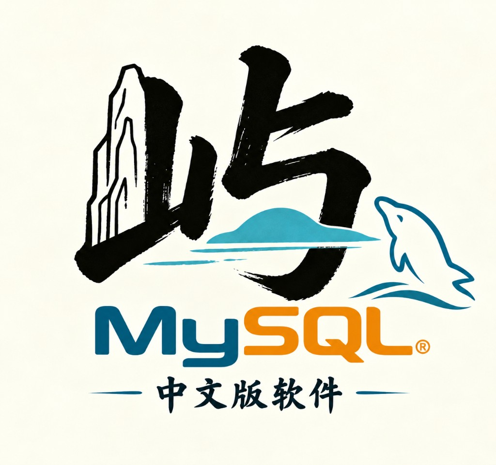

<div align="center">



# 🚀 屿·mysql

**屿宸网络科技工作室 · 开源可部署的 MySQL 可视化桌面工具（中文版）**

[](./version.json)
[](https://www.electronjs.org/)
[](https://react.dev/)
[](https://www.typescriptlang.org/)
[](https://vitejs.dev/)
[](https://www.mysql.com/)
[](https://github.com/Ms-liyc/MySQL-Chinese)

[](./LICENSE)

[](https://github.com/Ms-liyc/MySQL-Chinese)

**数据库连接与登录** · 记住密码 · 安全 IPC 通信 · 多库表浏览

**SQL 查询工作台** · Monaco 编辑器 · `Ctrl+Enter` 执行 · 结果表格展示

**可视化分析** · 表数据分页 · 表结构详情 · ER 关系图 · 查询结果图表 · 主题色定制

> 基于 Electron + React + TypeScript 构建，适合本地/远程 MySQL 日常查询、结构分析与数据浏览。

🌟 [Star 项目](https://github.com/Ms-liyc/MySQL-Chinese) · 📖 [快速开始](#-快速开始) · 🎨 [主题设置](#-主题设置) · 🐛 [反馈问题](https://github.com/Ms-liyc/MySQL-Chinese/issues) · 📋 [更新日志](#-更新日志)

</div>

---

## ✨ 功能概览

| 模块 | 说明 |
|------|------|
| 登录界面 | 双击打开，登录后进入查询界面，支持记住密码 |
| 数据库浏览器 | 树形展示数据库与数据表 |
| SQL 查询 | Monaco 编辑器，支持 `Ctrl+Enter` 快捷执行 |
| 表数据 | 分页浏览选中表的数据内容 |
| 表结构 | 字段、主键、外键详情 |
| ER 图 | 基于外键自动生成表关系图 |
| 图表 | 将 SELECT 结果可视化为柱状/折线/饼图 |
| 主题 | 深色/浅色模式，6 种预设主题色 + 自定义 |

## 📦 环境要求

- **Node.js 64 位** 18+（推荐，从 [nodejs.org](https://nodejs.org) 安装）
- 本地或远程 **MySQL 5.7+ / 8.x**

> 若同时安装了 `Program Files (x86)\nodejs`（32 位）和 64 位 Node，PATH 冲突会导致 Rollup 报错。请优先使用 64 位 Node。

## 🚀 快速开始

```bash
git clone https://github.com/Ms-liyc/MySQL-Chinese.git
cd MySQL-Chinese
npm install
npm run dev
```

## 🎨 主题设置

登录页或工作台右上角点击 **主题**，可切换：

- 深色 / 浅色外观
- 6 种预设主题色（蓝、绿、紫、玫瑰、琥珀、青）
- 自定义十六进制颜色
- 设置自动保存到本地

## 🛠 常用命令

| 命令 | 说明 |
|------|------|
| `npm run dev` | 启动开发模式（版本号自动 +1） |
| `npm run build` | 构建生产包 |
| `npm run typecheck` | TypeScript 类型检查 |
| `npm run fix:deps` | 修复 Rollup / Electron 原生依赖 |
| `npm run bump:version` | 手动递增版本号 |

## 🌐 国内镜像

项目已配置 **npmmirror** 镜像，加速 npm 包与 Electron 下载：

| 配置位置 | 作用 |
|----------|------|
| `.npmrc` | npm registry → `registry.npmmirror.com` |
| `package.json` → `config` | Electron 二进制镜像 |

```bash
npm run reinstall:electron
```

## ❓ 常见问题

### `@rollup/rollup-win32-xxx-msvc` 找不到

```bash
npm run fix:deps
npm run dev
```

### Electron 下载失败

```bash
npm run reinstall:electron
```

## 🏗 架构说明

```
src/
├── main/           # Electron 主进程 + mysql2 连接
├── preload/        # IPC 桥接
├── renderer/       # React 界面
└── shared/         # 共享类型与版本信息
```

MySQL 连接与 SQL 执行在主进程完成，渲染进程通过 IPC 调用，避免在浏览器上下文暴露数据库凭证。

## 📋 更新日志

| 版本 | 说明 |
|------|------|
| V0.1.1271 | 登录记住密码、主题色定制、表数据浏览、版本自动递增 |
| V0.1.1270 | 初始版本：登录界面、SQL 查询、ER 图、图表可视化 |

## 📄 开源协议

本项目采用 [MIT License](./LICENSE) 开源。

## 👥 开发团队

**屿宸网络科技工作室**

---

<div align="center">

**如果这个项目对你有帮助，欢迎 Star ⭐**

[https://github.com/Ms-liyc/MySQL-Chinese](https://github.com/Ms-liyc/MySQL-Chinese)

</div>
